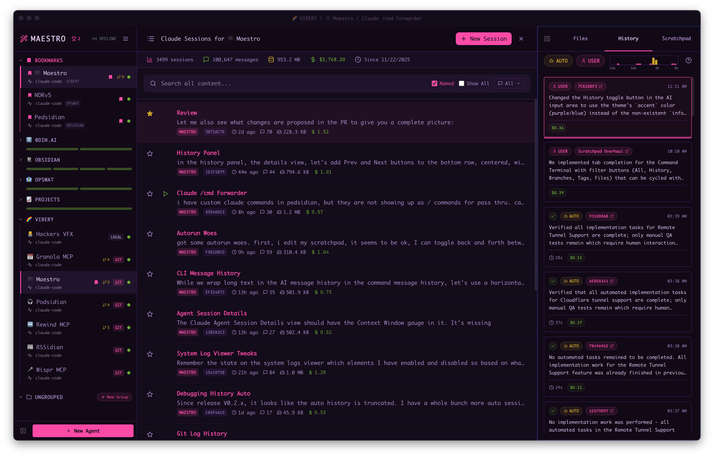

## UI Overview

Maestro features a three-panel layout:

- **Left Panel** - Agent list with grouping, filtering, search, bookmarks, and drag-and-drop organization
- **Main Panel** - Center workspace with two modes per agent:
  - **AI Terminal** - Converse with your AI provider (Claude Code, Codex, or OpenCode). Supports multiple tabs (each tab is a session), `@` file mentions, image attachments, slash commands, and draft auto-save.
  - **Command Terminal** - PTY shell with tab completion for files, branches, tags, and command history.
  - **Views**: Session Explorer, File Preview, Git Diffs, Git Logs
- **Right Panel** - Three tabs: File Explorer, History Viewer, and Auto Run

## Agent Status Indicators

Each agent shows a color-coded status indicator:

- 🟢 **Green** - Ready and waiting
- 🟡 **Yellow** - Agent is thinking
- 🔴 **Red** - No connection with agent
- 🟠 **Pulsing Orange** - Attempting to establish connection
- 🔴 **Red Badge** - Unread messages (small red dot overlapping top-right of status indicator, iPhone-style)

## File Explorer and Preview

The **File Explorer** (Right Panel → Files tab) lets you browse project files. Click any file to open it in the **File Preview** view.

**File Preview features:**
- **Syntax highlighting** for code files
- **Markdown rendering** with toggle between raw/preview (`Cmd+E` / `Ctrl+E`)
- **Image viewing** for common image formats
- **Line numbers** for easy reference
- **Search within file** (`Cmd+F` / `Ctrl+F`)

### Breadcrumb Navigation

When you open a file, a **breadcrumb trail** appears showing your navigation history. Click any breadcrumb to jump back to a previously viewed file. This makes it easy to compare files or return to where you were.

### File Editing

Files can be edited directly in the preview. Changes are saved automatically when you navigate away or close the preview.

### @ File Mentions

Reference files in your AI prompts using `@` mentions:
1. Type `@` followed by a filename
2. Select from the autocomplete dropdown
3. The file path is inserted, giving the AI context about that file

## Prompt Composer

For complex prompts that need more editing space, use the **Prompt Composer** — a fullscreen editing modal.

**To open the Prompt Composer:**
- Click the **pencil icon** (✏️) in the bottom-left corner of the AI input box

The Prompt Composer provides:
- **Full-screen editing space** for complex, multi-paragraph prompts
- **Character and token count** displayed in the footer
- **All input controls** — History toggle, Read-only mode, Thinking toggle, and send shortcut indicator
- **Image attachment support** via the image icon in the footer

When you're done editing, click **Send** or press the displayed shortcut to send your message. The composer closes automatically and your prompt is sent to the AI.

## Input Toggles

The AI input box includes three toggle buttons that control session behavior:

| Toggle | Shortcut | Description |
|--------|----------|-------------|
| **History** | `Cmd+S` / `Ctrl+S` | Save a synopsis of each completion to the [History panel](./history) |
| **Read-only** | `Cmd+R` / `Ctrl+R` | Enable plan/read-only mode — AI can read but not modify files |
| **Thinking** | `Cmd+Shift+K` / `Ctrl+Shift+K` | Show streaming thinking/reasoning as the AI works |

**Per-tab persistence:** Each toggle state is saved per tab. If you enable Thinking on one tab, it stays enabled for that tab even when you switch away and back.

### Configuring Defaults

Set the default state for new tabs in **Settings** (`Cmd+,` / `Ctrl+,`) → **General**:

| Setting | Description |
|---------|-------------|
| **Enable "History" by default** | New tabs save synopses to History automatically |
| **Enable "Thinking" by default** | New tabs show thinking/reasoning content by default |

### Send Key Configuration

Configure how messages are sent in each mode:

| Mode | Options | Description |
|------|---------|-------------|
| **AI Interaction Mode** | `Enter` or `Cmd+Enter` | Choose your preferred send key for AI conversations |
| **Terminal Mode** | `Enter` or `Cmd+Enter` | Choose your preferred send key for shell commands |

- When set to `Cmd+Enter` / `Ctrl+Enter`, pressing `Enter` alone creates a new line (for multi-line input)
- When set to `Enter`, use `Shift+Enter` for new lines
- The current send key is displayed in the input box (e.g., "⌘ + Enter")
- **Per-tab override:** Click the send key indicator in the input box to toggle between modes for that tab

## Image Carousel

When working with image attachments, use the **Image Carousel** to view, manage, and remove images.

**To open the Image Carousel:**
- Press `Cmd+Y` / `Ctrl+Y`, or
- Click the image icon in the input box when images are attached

**Carousel controls:**
- **Arrow keys** — Navigate between images
- **Delete** or **Backspace** — Remove the currently selected image
- **Click the X** — Remove an image by clicking its remove button
- **Esc** — Close the carousel

Images can be attached via drag-and-drop, paste, or the attachment button. The carousel shows all images queued for the current message.

## Output Filtering

Search and filter AI output with include/exclude modes, regex support, and per-response local filters.

## Command Interpreter

The command interpreter can be focused for a clean, terminal-only experience when you collapse the left panel.

## Session Management

Browse, star, rename, and resume past sessions. The Session Explorer (`Cmd+Shift+L` / `Ctrl+Shift+L`) shows all conversations for an agent with search, filtering, and quick actions.

